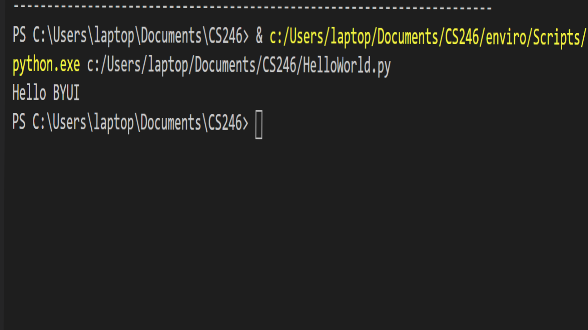

# Overview:
This program will say hello to BYUI. It Uses Python 3.8.5 with Visual Studio Code and Github.

# Development Enviroment:
* Visual Studio Code
* Python 3.8.5

# Execution:
To execute the program: 'python HelloWorld.py'

# Useful Websites:
* [Python reference](https://docs.python.org/3.8/tutorial/index.html)